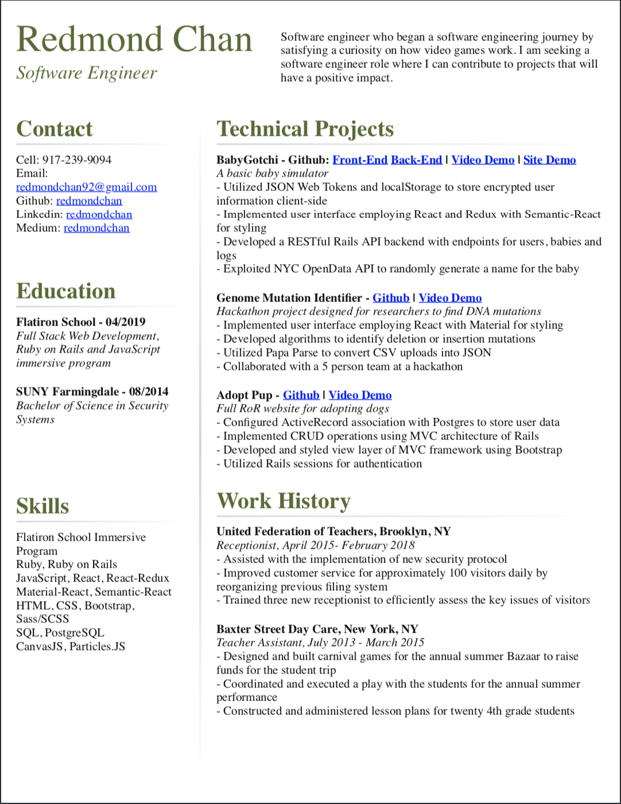

# grid-resume

I'm creating my resume with the grid CSS property.

# How to save as PDF

Open this with chrome and press CTRL+P or CMD+P to open the print dialog. Change the destination printer to "Save as PDF". You may need to customize the margins.

I've attached my resume.

Here's a screenshot:

